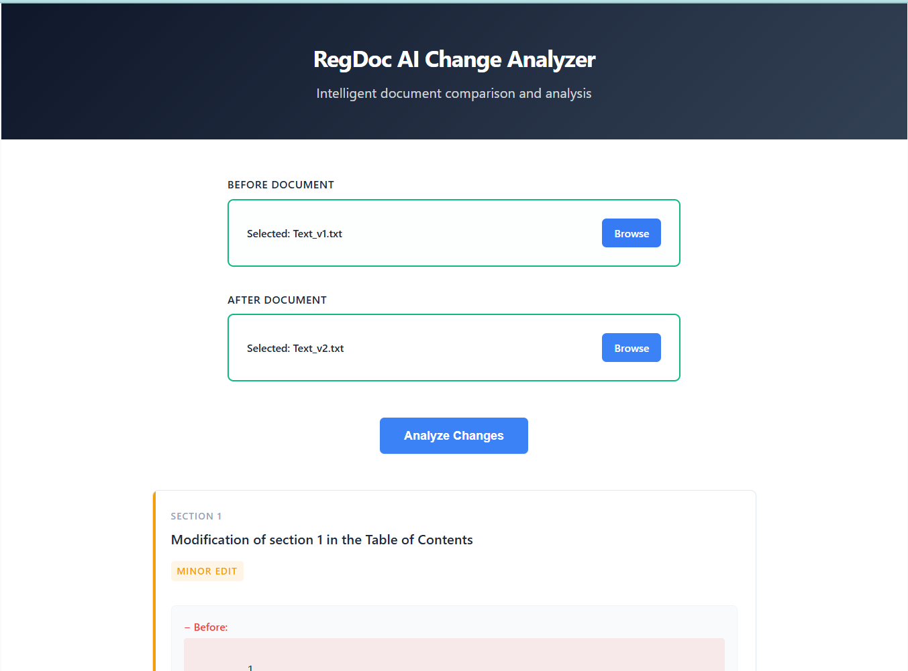
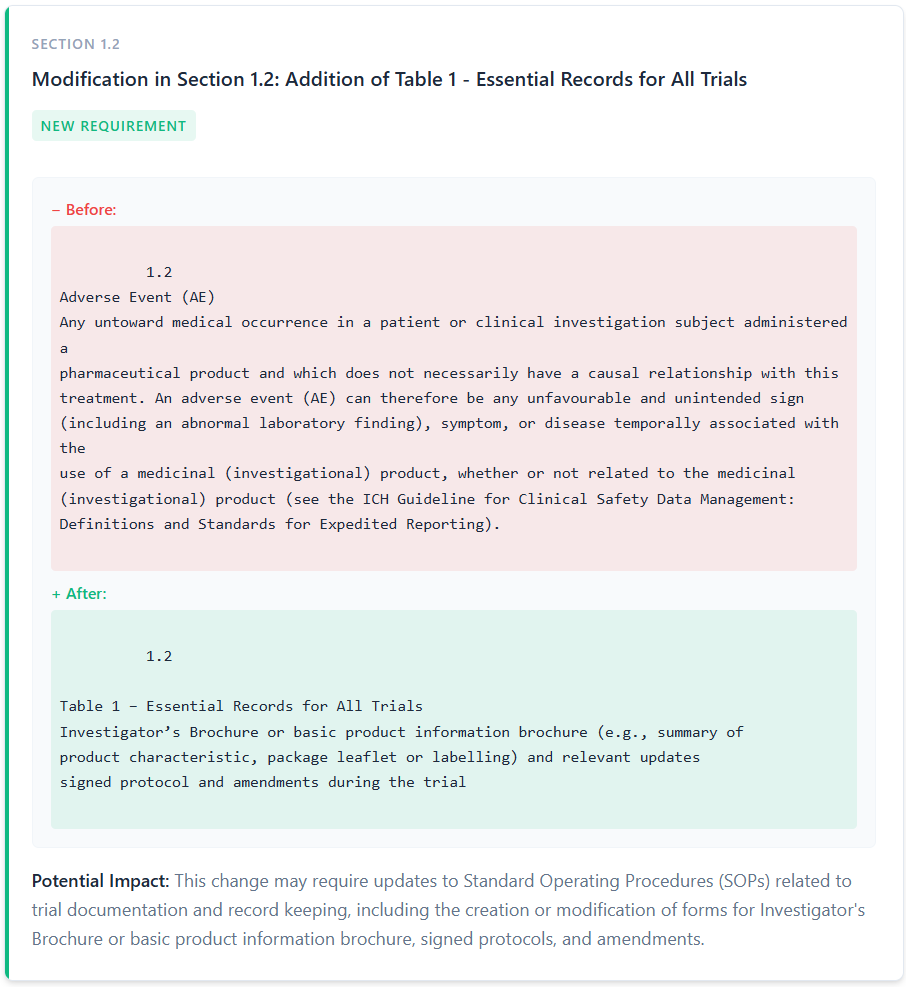
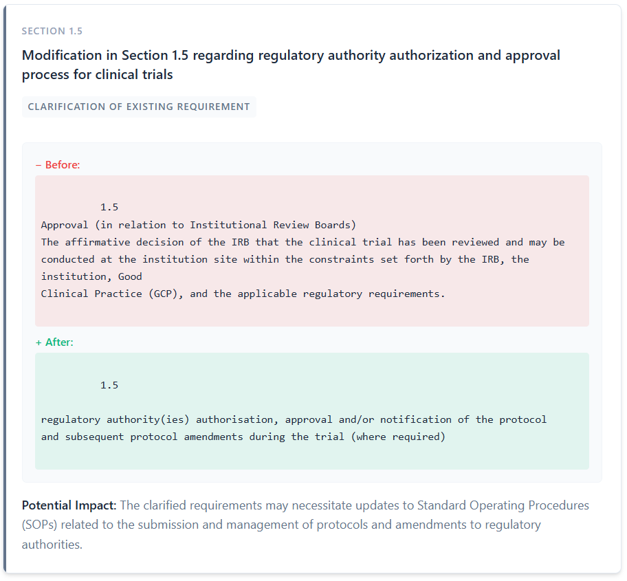
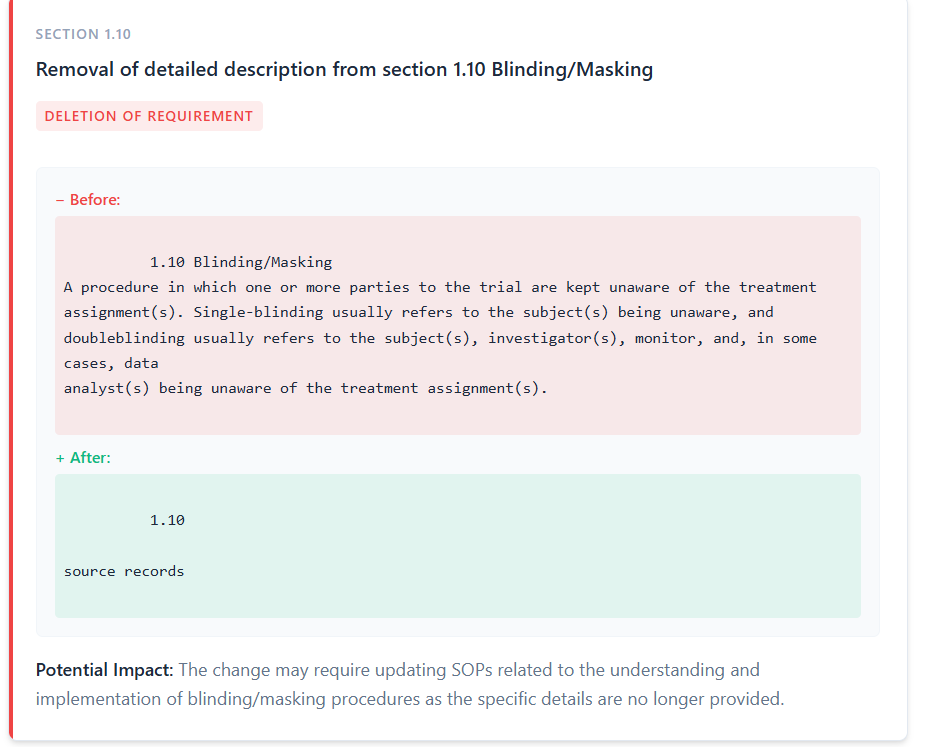
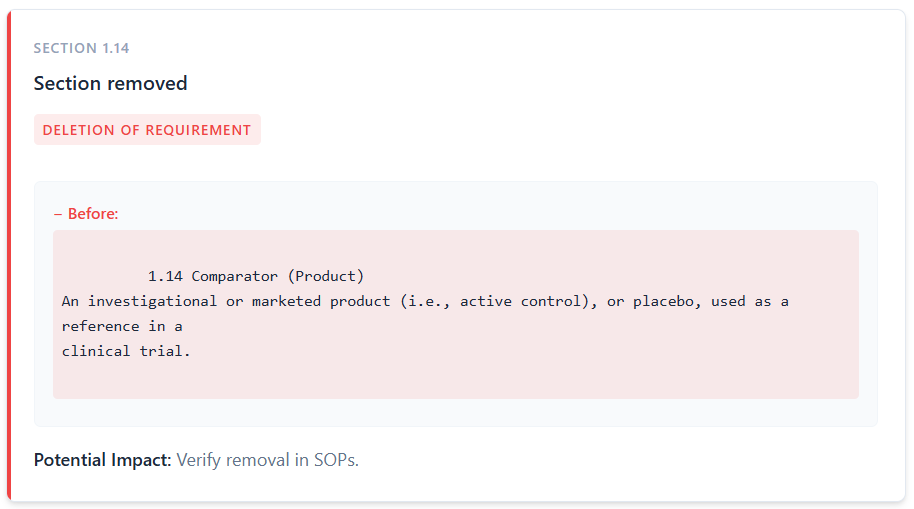
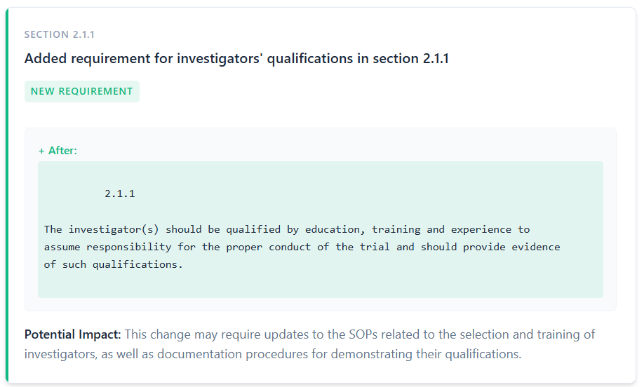
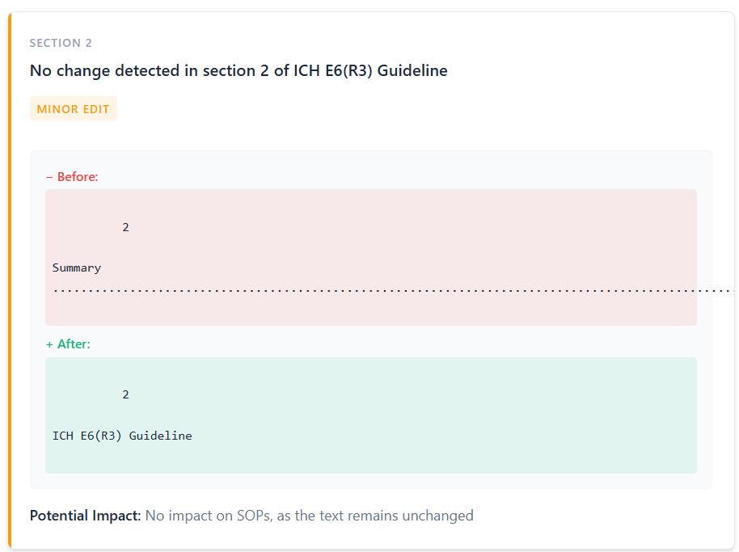
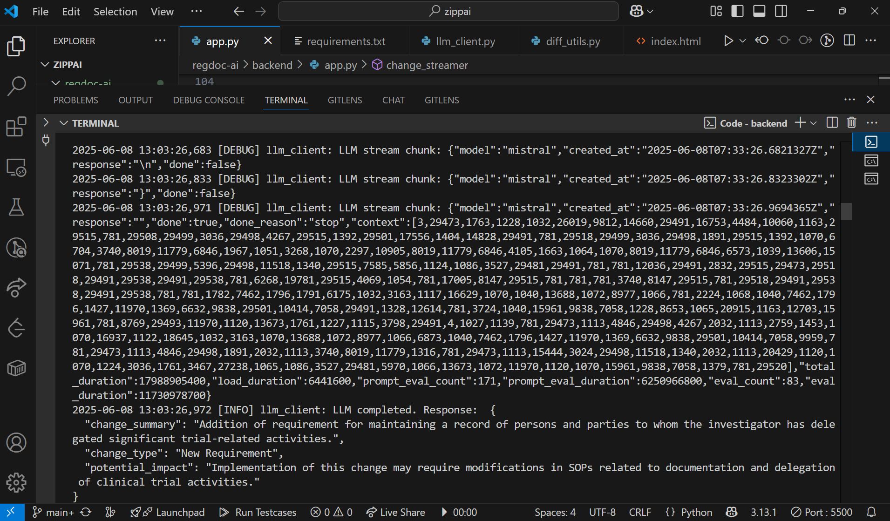

# regdoc-ai

## File uploader before and after with analyze button

## New Requirement LLM response -before +after potential impact

## Clarification of Existing Requirement LLM response -before +after potential impact

## Deletion of Requirement LLM response -before +after potential impact

## Deletion of Requirement LLM response -before potential impact

## New Requirement LLM response -before +after potential impact

## Minor Edit LLM response -before +after potential impact

## LLM chunk response sent to python backend by Mistral

# My Understanding & Implementation Details

- ## Understanding of the Problem

    - Regulatory guidelines are structured with hierarchical section numbers (e.g., 1.2.3, 2.2).

    - Page numbers and in-text numeric references also appear but lack dots, so a parsing rule is needed to distinguish true sections from incidental numbers.

    - Quality Assurance teams currently perform manual, line-by-line comparisons—an error-prone, time-consuming process that risks non-compliance and audit findings.

    - Automating the detection of Added, Deleted, and Modified sections and providing initial impact analysis accelerates SOP updates and reduces human error.

- ## What I Did

  - ### Custom Diff Algorithm

      - Parsed both text_v1.txt and text_v2.txt by extracting genuine section numbers (keys containing .) into a map:section_number → section_content.

      - Differentiated sections:

          - Deleted: Present only in the old document.

          - Added: Present only in the new document.

          - Modified: Present in both but with content changes.

       - Bypassed external diff libraries to handle complexities (page numbers vs. section numbers).

  - ### LLM Integration (Mistral via Ollama)

       - For each Added or Modified section, streamed the section text to Mistral.

       - Prompted the LLM to emit a structured JSON chunk stream containing:
        
       - change_summary: concise, one-line summary
        
       - change_type: classification (e.g., "New Requirement", "Clarification")
        
       - potential_impact: initial impact assessment
        
       - Kept the HTTP connection alive to send back each JSON chunk as it completed, enabling real-time frontend updates.
        
  - ### Backend (Python, FastAPI, Uvicorn)
        
       - Built an /api/analyze endpoint that:
        
          - Accepts two uploaded files (Before and After).

          - Runs the diff algorithm to detect sections.

          - Streams each change through the LLM and forwards JSON chunks to the client.

       - Leveraged Uvicorn for asynchronous request handling and streaming support.

   - ### Frontend (HTML, CSS, JavaScript)

     - Created a simple interface with:

       - Two file inputs: Before & After.

       - An Analyze Changes button.

       - A container to display change cards as they arrive.

     - On button click, sent a fetch() request with FormData, kept the ReadableStream open.

     - Parsed each incoming JSON chunk and appended a card showing:

       - Summary, Type, and Potential Impact

      - Ensured the user sees results incrementally, improving engagement during longer analyses.

